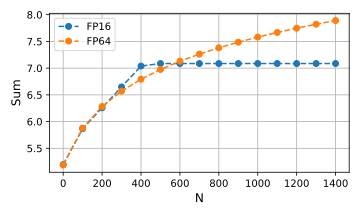

# Вычислительная неустойчивость

Наличие погрешности округления при работе с числами с конечной точностью может приводить к вычислительной неустойчивости, то есть накоплению погрешности округления.
В первую очередь это происходит либо при проведении арифметических операций над числами, сильно отличающимися по амплитуде, либо при вычитании близких по амплитуде чисел.
В обоих сценариях после проведения арифметической операции теряются некоторые старшие биты, и, следовательно, точность числа определяется только младшими битами, что дает относительную погрешность выше машинного эпсилон.
Ниже мы рассмотриваем несколько классических примеров.
Для улучшения устойчивости производят алгебраически эквивалентные преобразования, изменяющие порядок арифметических операций на более предпочтительный.

## Вычитание близких чисел (catastrophic cancellation)

Потеря старших битов при вычитании двух близких чисел:
```python
import numpy as np

a = np.float16(1.234)
b = np.float16(1.245)
res_fp16 = a - b
print(res_fp16)  # -0.01074
res_fp64 = 1.234 - 1.245
print(res_fp16)  # -0.011
print(np.abs(res_fp16 - res_fp64) / np.abs(res_fp64)  # 0.0234, relative error
print(np.finfo(np.float16).resolution)  # 0.001, expected relative error of FP16
```

## Сложение чисел с сильно отличающимися амплитудами

При прибавлении маленького числа к большому теряются старшие биты маленького числа.
В крайнем случае эта операция становится эквивалентной прибавлению нуля.
Подобная проблема возникает при аккумуляции ряда чисел в некоторой переменной через суммирование.
Рассмотрим в качестве примера сумму гармонического ряда, то есть
$$
s = \sum_{i=1}^n \frac{1}{i}.
$$

```python
import numpy as np
import matplotlib.pyplot as plt

def harmonic_sum(n, dtype=np.float16, save_freq=1000):
    res_array = []
    res = dtype(0.0)
    for i in range(1, n + 1):
        res += dtype(1.0) / dtype(i)
        if i % save_freq == 0:
            res_array.append(res)

    return res_array

save_freq = 100
max_n = 1500
fig, ax = plt.subplots(1, 1, figsize=(5, 3))
for dtype, label in zip((np.float16, np.float64), ("FP16", "FP64")):
    res_array = harmonic_sum(max_n, dtype=dtype, save_freq=save_freq)
    ax.plot(range(0, max_n, save_freq), res_array, "o--", label=label)
ax.set_xlabel("N", fontsize=12)
ax.set_ylabel("Sum", fontsize=12)
ax.grid()
ax.legend()
fig.tight_layout()
fig.savefig("harmonic_sum.svg")
```



Как можно заметить, уже при $N > 400$ наступает стагнация в случае суммирования чисел, храняющихся в FP16.
В дальнейшем погрешность суммирования будет только накапливаться.

## Деление на маленькое число / умножение на большое число

Обе операции усиливают погрешность округления. Характерным историческим примером такой вычислительной неустойчивости является [Patriot Missile Failure](https://www-users.cse.umn.edu/~arnold/disasters/patriot.html) в войне в Персидском заливе в 1991 году, о котором стало известно благодаря докладу в счетной палате США. Тогда американская ракета ЗРК "Пэтриот" не смогла перехватить иракскую баллистическую ракету Р-17, что привело к гибели 28 американских солдат. Причиной промаха была неверная оценка времени, прошедшего со старта ракеты "Пэтриот". Само время хранилось в целочисленной переменной как число десятых долей секунды, то есть как число прошедших децисекунд. Чтобы получить время в секундах, необходимое для оценки траектории перехвата, значение этой переменной умножается на 0.1. Однако 0.1 не представимо в виде суммы степеней двойки, так что неизбежно будет возникать погрешность округления. В ракетах "Пэтриот" использовались 24-битные представления вещественных чисел, так что для 100 часов, прошедших с момента запуска системы управления, накопленная ошибка составила 0.34 секунды, чего было достаточно для промаха.

Тот же эксперимент в 16-битных числах даст погрешность примерно 9 секунд:
```python
x_fp16 = total_tenth_seconds * np.float16(0.1)
x_fp64 = total_tenth_seconds * np.float64(0.1)
print((x_fp64 - x_fp16) / 10)  # 8.7890625
```

# Базовые алгоритмы, повышающие устойчивость

## Суммирование Кэхэна

Этот алгоритм используется для вычисления сумм вида $s = \sum_{i=1}^n a_i$.
Как мы уже убедились, наивная имплементация может приводить к систематической потере младших битов и соответствующему накоплению погрешности округления.
Суммирование Кэхэна решает до некоторой степени эту проблемы с помощью отдельной переменной $c$, поддерживающей отброшенные младшие биты:
1. Инициализация: $s = 0$, $i = 1$, $c = 0$
2. Компенсируем потерянные биты: $y = a_i - c$
3. Сохраняем сумму с добавкой во временной переменной, осознавая, что здесь происходит потеря младших битов: $t = s + y$
4. Сохраняем потерянные биты: $c = (t - s) - y$
5. Обновляем значение суммы: $s = t$
6. $i = i + 1$
7. Goto 2 пока $i \leq n$

## Схема Горнера

Этот алгоритм используется для вычисления значений полиномов вида
$$
f(x) = \sum_{i=0}^n a_i x^i.
$$
Наивная реализация подобного вычисления является крайне неустойчивой из-за больших степеней.
Кроме того, она неоптимальна с точки зрения количества умножений и сложений.
Схема Горнера решает обе проблемы и является вычислительно оптимальной, требуя только $n$ умножений и $n$ сложений:
$$
f(x) = a_0 + x\left( a_1 + x \left( a_2 + x (a_3 + \dots + x(a_{n-1} + x a_n)) \right) \right).
$$

# LU разложение

Под [LU разложением](http://getsomemath.ru/subtopic/computational_mathematics/numerical_linear_algebra/gauss_methods) квадратной матрицы $\boldsymbol{A} \in \mathbb{R}^{n \times n}$ подразумевают разложение $\boldsymbol{A} \in \mathbb{R}^{n \times n} = \boldsymbol{L} \boldsymbol{U}$.
Верхняя треугольная матрица $\boldsymbol{U}$ получается в результате прямого хода метода Гаусса.
Нижняя треугольная матрица $\boldsymbol{L}$ строится на основе множителей $m_{ik} = a_{ik}^{(k)} / a_{kk}^{(k)}$, рассчитываемых на $k$-й итерации прямого хода:
$$
\boldsymbol{L} =
\begin{bmatrix}
1 & 0 & \dots & 0 \\
m_{21} & 1 & \ddots & \vdots \\
\vdots &  \ddots & \ddots & 0 \\
m_{n1} & \dots & m_{n, n-1} & 1
\end{bmatrix}.
$$

Решение СЛАУ $\boldsymbol{A} \boldsymbol{x} = \boldsymbol{b}$ в таком случае происходит в два этапа.
Сначала мы находим решение $\boldsymbol{y}$ для 
$$
\boldsymbol{L} \boldsymbol{y} = \boldsymbol{b},
$$
а затем финальное решение $\boldsymbol{x}$ для
$$
\boldsymbol{U} \boldsymbol{x} = \boldsymbol{y}.
$$

Для улучшения вычислительной устойчивости используют выбор главного элемента (pivoting).

# Разложение Холецкого

По [теореме о разложении Холецкого](http://getsomemath.ru/subtopic/computational_mathematics/numerical_linear_algebra/gauss_methods), любую положительно определенную матрицу $\boldsymbol{A}$ можно представить в виде произведения $\boldsymbol{A} = \boldsymbol{L} \boldsymbol{L}^T$, где $\boldsymbol{L}$ - нижняя треугольная матрица с ненулевыми элементами на главной диагонали.
Элементы матрицы $\boldsymbol{L}$ вычисляются следующим образом:
$$
l_{ii} = \sqrt{a_{ii} - \sum_{j = 1}^{i-1} l_{ij}^2}, \quad i = 1, \dots, n,
$$

$$
l_{ij} = \frac{1}{l_{jj}}\left(a_{ij} - \sum_{k = 1}^{j-1} l_{ik} l_{jk}\right), \quad j < i.
$$

